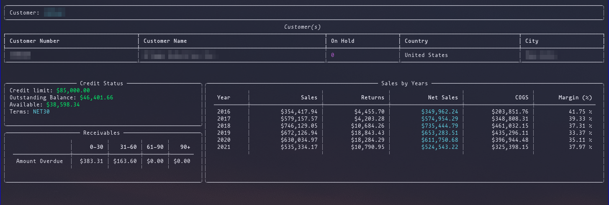
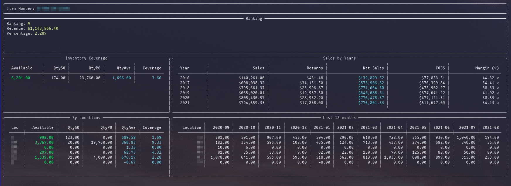

# py300

py300 is a simple CLI python app based on [click](https://click.palletsprojects.com/en/8.0.x/) and [rich](https://github.com/willmcgugan/rich)to retreive information from Sage300.

## Setup

### Intall required packages

Install packages with pip: -r requirements.txt

`pip install -r requirements.txt`

### Set up ODBC for GNU/Linux

#### Installing FreeTDS and unixODBC:

`sudo pacman -S unixodbc freetds`

#### Registering the ODBC driver with freeTDS:

Create or edit `/etc/odbcinst.ini` and `/etc/odbc.ini` with the following content:

- /etc/odbcinst.ini
```
[FreeTDS]
Description     = FreeTDS
Driver          = /usr/lib/libtdsodbc.so.0
```

- /etc/odbc.ini

```
[SQLServer]
Driver = FreeTDS
Description = Connection to SQL Server
Trace = No
Server = IP_ADDRESS
Port = 1433
TDS version = VERSION
Database = DB_NAME
```

Make sure to change `IP_ADDRESS`, `VERSION` and `DB_NAME`.

#### Testing connection via command line

`isql -v SQLServer <user> <password>`


## Getting started

### Customer module

This "module" (command) can filters customers or retreive customer information such as sales history by years, credit status and receivables.

 

### Inventory module

Similar to the customers inventory command can filter items and display item information such as sales by years, availabily by locations; it also calculate the ranking using the [Pareto principle](https://en.wikipedia.org/wiki/Pareto_principle) and the coverage in month based on the sales for the last 12 periods (globally and by locations).

 

**TODO**

- Ranking summary
- Sales forecasting
- Backorder
- General ledger (Financial Statements)
- Dashboard
